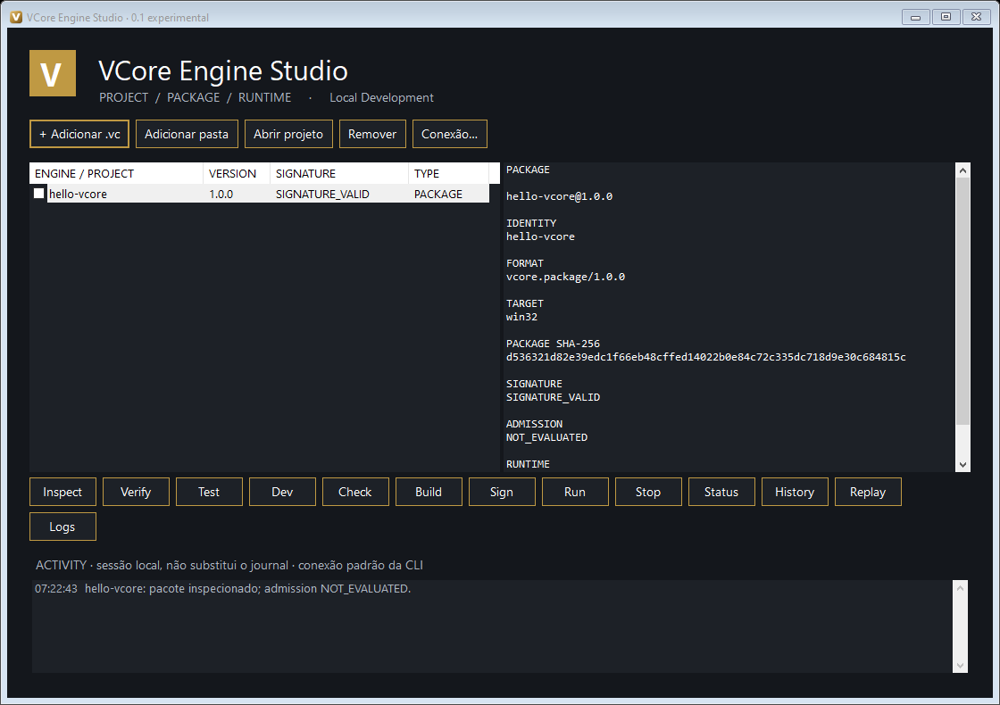

# VCore Native Container
## Experimental Edition For Engines VCore

**[Português](README.pt-BR.md) · [English](README.md)**

Um ponto de partida prático para desenvolver, inspecionar e empacotar motores VCore.
O **VCore Engine Studio** é o ambiente visual. A **plataforma de desenvolvimento**
oferece as mesmas operações por comandos de texto. O **Native Container** é o ambiente
de execução controlado pelo operador e instalado separadamente.



### Comece aqui

- **[Baixar a edição experimental para Windows](https://github.com/VoigtCore/VCore-Native-Container/releases/tag/v0.1.0-experimental)**
- **[Manual ilustrado, passo a passo](docs/manual.pt-BR.md)**
- [Manual em inglês](docs/manual.en.md)
- [Exemplo .vc pronto para inspecionar](packages/hello-vcore-1.0.0-demo-signed.vc)
- [Código da engine de exemplo](examples/hello-vcore) · [Contrato da engine](docs/ENGINE-CONTRACT.md)

### O que você pode fazer

Abrir um projeto, testar, gerar um `.vc`, inspecionar pacotes, verificar assinaturas
e assinar com uma chave de publisher que você esteja autorizado a usar. Depois da
admissão pelo operador: executar, parar, consultar estado, registros e histórico.
Replay consulta a trajetória existente; não repete o trabalho.

```text
Seu motor → Testes → Pacote .vc → Assinatura → Admissão pelo operador
                                                       ↓
                                                Native Container
                                                       ↓
                                               Execução e histórico
```

**Este download público não contém nem instala o runtime privado do operador.**
Desenvolvimento e inspeção locais funcionam sem ele. A execução no Native Container
exige um serviço separado, credenciais, política, confiança no publisher e admissão
do pacote. Adicionar um arquivo ao Studio não concede essas permissões.

### Versões e estágio atual

| Componente | Versão / estado |
|---|---|
| Engine Studio | 0.1.0-experimental, Windows x64 |
| Plataforma de desenvolvimento | 0.2.0-experimental |
| SDK público / contrato | 1.0.0 |
| Motor de exemplo | hello-vcore 1.0.0, Windows x64, Node 24.13.1 fixado por hash |
| Produção | NOT_READY |

O ZIP Windows inclui Node.js e seus avisos de licença. O Studio exige .NET Framework
4.x. Linux utiliza ferramentas por comandos de texto; esta interface visual não é
uma aplicação Linux. A validação nativa Linux não é afirmada nesta entrega.

Os quatro testes de aceitação existentes do Studio passaram, incluindo execução real
com operador provisionado separadamente e recusa após revogação. O exemplo incluído
passa no teste de contrato e na verificação de assinatura. Instalação em computador
novo, instalação/reinício do serviço Windows e estabilidade sob carga seguem em
validação. Dois timeouts da regressão ampla anterior permanecem registrados; os
reensaios isolados passaram. Isso não constitui prontidão para produção.

### O que fica protegido

O repositório não contém Core privado, fontes comerciais do Pulse, bancos, chaves
raiz, autoridade de admissão ou credenciais do operador. A assinatura do exemplo
usa um **publisher descartável de demonstração**, sem confiança oficial. Somente
sua chave pública é publicada.

O executável **ainda não tem assinatura Authenticode**. Confira [SHA256SUMS](SHA256SUMS)
e use os downloads deste repositório. O checksum verifica o arquivo, não representa
uma certificação independente do publisher. Repositório público não significa
licença de código aberto: veja [LICENSE](LICENSE) e [segurança](SECURITY.md).
