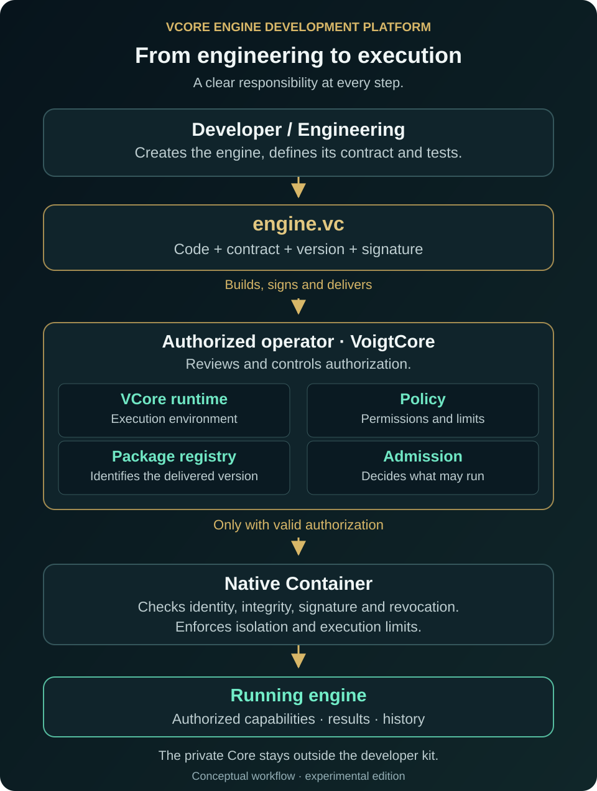
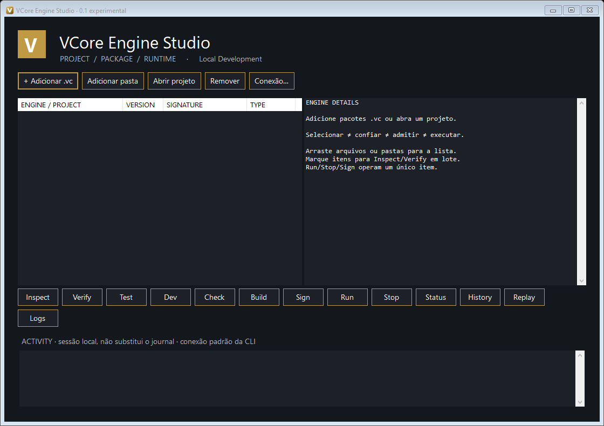

# Your first VCore engine — illustrated guide

The demonstration package is signed, not encrypted. It contains public example
code only. A signature establishes integrity, not confidentiality or publisher trust.

[Português](manual.pt-BR.md) · [Back to overview](../README.md)

## 1. Understand the parts

An **engine** is a program with a defined responsibility. **.vc** is its package,
carrying code and a contract for verification. **Studio** is the visual workspace
for projects and packages. **Native Container** runs authorized packages under the
operator's rules. Selecting a file, verifying a signature and admitting a package
are different steps. Engineers develop; operators control execution permission.



## 2. Download and open Studio

Open the [experimental release](https://github.com/VoigtCore/VCore-Native-Container/releases/tag/v0.1.0-experimental),
download the Windows ZIP and compare its SHA-256 using `Get-FileHash ZIP_PATH -Algorithm SHA256`.
Extract **the entire ZIP** into a user folder and open `VCore-Engine-Studio.exe`.
Keep `platform` beside it. The public kit does not require access to private Core source.



## 3. Inspect the included .vc

Download `hello-vcore-1.0.0-demo-signed.vc` from the same release. In Studio, choose
**Adicionar .vc** (Add .vc), select the file and select its row. **Inspect** shows
identity, version, target, hash and signature. **Verify** checks integrity and
signature. Expect `SIGNATURE_VALID`, not admission.

This example reports only its own readiness. It does not read sensors, measure
host health or access secrets. Its publisher is a disposable demonstration signer.
**Run still needs a separately provisioned operator and explicit admission.**


Add multiple files, use **Adicionar pasta** (Add folder), or drag files/folders into
the list. Checked rows support batch inspection/verification. Remove only removes
the entry from this session. The list does not persist in this version. Screenshots
show the real interface, whose labels currently mix Portuguese and English.

## 4. Open the development tools

From the extracted directory, run `.\platform\install.ps1 -AddToPath` in PowerShell.
This installs public tools into a user folder, without creating a service, credentials
or admission. Open a new terminal—a window for typing commands—and enter:

```powershell
vcore --version
vcore doctor
vcore new my-engine
cd my-engine
```

Doctor reports available features and missing operator prerequisites. A missing
runtime does not prevent local creation, testing, packaging or inspection.

## 5. Develop and test

Edit `src/main.mjs`, preserve the public contract and add tests under `tests`.
**Abrir projeto** (Open project) selects the project folder. Test, Dev and Check
use the same commands as the terminal:

```powershell
vcore test
vcore dev
vcore check
```

Test and Dev run project tests as your local user, outside Native Container. Only
run trusted source. Dev is not a live-reloading server in this version. Study the
[complete example](../examples/hello-vcore) for the minimal structure.

## 6. Build a package

```powershell
vcore build
vcore inspect dist/engine.vc
```

Build includes recipe-declared files and refreshes their hashes. Studio adds the
output to its list. New builds are **UNSIGNED**. Changed packages must be rebuilt
and signed again.

## 7. Sign when authorized

Select one package and choose Sign. Supply your authorized publisher key and a
new output filename. No official private signing key is supplied by this kit.

```powershell
vcore sign dist/engine.vc --key=C:/MyKey/publisher.pem --out=dist/signed.vc
vcore verify dist/signed.vc
```

Never put private keys in the project or GitHub. The example public key can be used
for verification; it cannot sign your packages. A signature does not establish trust.

## 8. Hand the artifact to the operator

Provide the `.vc`, hash and requested capabilities. The operator provisions Native
Container separately, reviews publisher and policy, and registers/admits the package
with operator credentials. These steps are not automatic:

```powershell
# Operator only, after review and appropriate configuration:
vcore registry add dist/signed.vc --config=C:/Operator/connection.json
vcore registry admit my-engine@1.0.0 --config=C:/Operator/connection.json
```

Paths above are examples, not supplied files. The private runtime is not in this
public download. Run being denied without service/admission is expected behavior.

## 9. Run and follow the history

Use **Conexão…** (Connection) to select the file supplied by the operator. Choose an
admitted package, then Run, Status, Logs, History and Stop. Studio reinspects the
package and addresses the runtime by its hash. It cannot bypass signature, identity,
permissions or revocation.

```powershell
vcore run my-engine@1.0.0
vcore status my-engine@1.0.0
vcore history my-engine@1.0.0
vcore stop my-engine@1.0.0
```

Terminal runtime commands need a configured platform connection. Operational results
are structured text. History reads the existing execution journal. Replay only reads
the trajectory; it does not rerun work. Activity is temporary window activity, not
the runtime journal. Closing Studio does not stop the separate runtime service.

## 10. Evolve with control

Give each engine a contract, tests and version. After a change: test → build → sign
→ operator review/admission. Revocation blocks new execution starts while preserving
history. Never treat the demonstration signature as production authorization.

**Experimental:** clean-machine, complete Windows service lifecycle and load validation
remain pending. Studio is Windows x64. The example targets Windows and the recipe's
Node 24.13.1 binary hash; Linux needs its own package and runtime validation. This
delivery does not migrate or change commercial Pulse.
