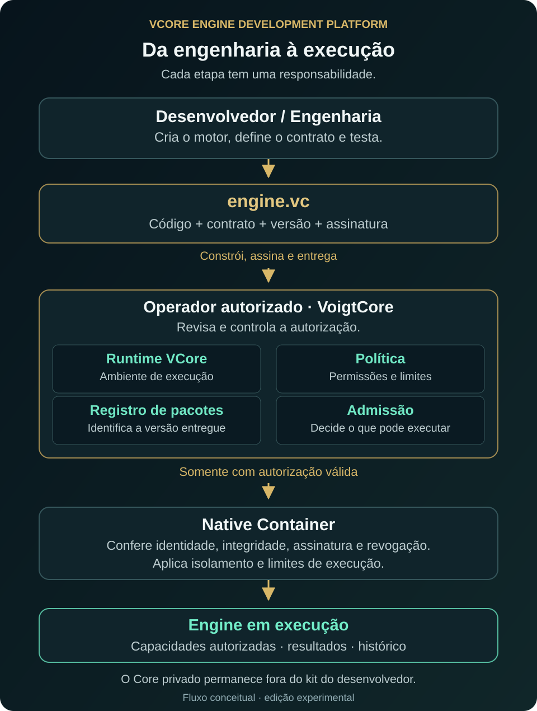

# Seu primeiro motor VCore — guia ilustrado

[English](manual.en.md) · [Voltar ao início](../README.pt-BR.md)

## 1. Entenda as três peças

**Motor (engine)** é um programa com uma responsabilidade definida. **.vc** é o
pacote que carrega seu código e contrato para verificação. **Studio** permite
trabalhar visualmente com projetos e pacotes. O **Native Container** executa somente
os pacotes autorizados, dentro das regras do operador.

O engenheiro desenvolve e entrega. O operador decide o que pode executar. Um arquivo
selecionado, uma assinatura válida e uma admissão são estados diferentes.



## 2. Baixe e abra o Studio

Abra a [versão experimental](https://github.com/VoigtCore/VCore-Native-Container/releases/tag/v0.1.0-experimental),
baixe o ZIP Windows e confira seu SHA-256 com `Get-FileHash CAMINHO_DO_ZIP -Algorithm SHA256`.
Extraia **todo** o ZIP para uma pasta do seu usuário. Abra `VCore-Engine-Studio.exe`.
Mantenha a pasta `platform` ao lado dele. Não é preciso instalar o Core privado.


## 3. Experimente um .vc pronto

Na mesma versão, baixe `hello-vcore-1.0.0-demo-signed.vc`. No Studio, clique em
**Adicionar .vc**, escolha o arquivo e selecione a linha da engine. **Inspect**
mostra identidade, versão, plataforma, hash e assinatura. **Verify** confere
integridade e assinatura. O resultado esperado é `SIGNATURE_VALID`.

Este exemplo informa apenas que seu próprio motor está pronto. Não lê sensores,
não avalia a saúde do computador e não acessa segredos. Sua assinatura é demonstrativa:
verificar não registra nem admite o pacote. **Run ainda depende do operador.**

O pacote de demonstração é assinado, não cifrado. Ele contém somente código público
do exemplo; assinatura comprova integridade, não confidencialidade nem confiança.


Você pode selecionar vários `.vc`, adicionar uma pasta ou arrastar arquivos para
a lista. Marcar várias linhas permite inspecionar/verificar em lote. Remover retira
o item da sessão, sem apagar o arquivo. A lista não persiste ao fechar esta versão.

## 4. Abra as ferramentas de desenvolvimento

Na pasta extraída, execute `.\platform\install.ps1 -AddToPath` no PowerShell. Esse
instalador copia as ferramentas públicas para uma pasta do usuário; não cria
serviço, credenciais ou admissão. Abra um novo terminal e use:

```powershell
vcore --version
vcore doctor
vcore new meu-motor
cd meu-motor
```

Um terminal é uma janela em que você digita comandos. `doctor` mostra o que está
disponível e o que depende de um operador. Aviso de runtime ausente não impede
criar, testar, empacotar e inspecionar localmente.

## 5. Desenvolva e teste

Edite `src/main.mjs` no seu editor. Preserve o contrato público de entrada e saída.
Inclua testes em `tests`. No Studio, **Abrir projeto** seleciona essa pasta;
**Test**, **Dev** e **Check** usam as mesmas operações dos comandos abaixo:

```powershell
vcore test
vcore dev
vcore check
```

Test e Dev executam os testes do projeto como seu usuário local, fora do Native
Container. Use fontes confiáveis. Nesta versão, Dev não é um servidor com atualização
automática. O [exemplo completo](../examples/hello-vcore) também pode ser estudado.

## 6. Gere seu pacote

```powershell
vcore build
vcore inspect dist/engine.vc
```

Build reúne os arquivos declarados na receita, atualiza os hashes e produz o `.vc`.
No Studio, ele também adiciona o pacote à lista. O novo build é **UNSIGNED** até
receber assinatura; modificar um pacote exige construir e assinar novamente.

## 7. Assine quando autorizado

No Studio, selecione um único pacote e clique **Sign**. Escolha a chave do seu
publisher e um arquivo de saída novo. O kit não fornece chave privada oficial.

```powershell
vcore sign dist/engine.vc --key=C:/MinhaChave/publisher.pem --out=dist/signed.vc
vcore verify dist/signed.vc
```

Não coloque chaves privadas no projeto ou no GitHub. A chave pública do exemplo
serve para conferência; não permite assinar seus próprios pacotes.

## 8. Entregue ao operador

Entregue o `.vc`, seu hash e as capacidades solicitadas. O operador configura o
serviço Native Container, revisa publisher/política e registra/admite o pacote
usando suas próprias credenciais. Esses passos não são automáticos:

```powershell
# Executados pelo operador, após revisão e configuração apropriadas:
vcore registry add dist/signed.vc --config=C:/Operador/conexao.json
vcore registry admit meu-motor@1.0.0 --config=C:/Operador/conexao.json
```

As pastas acima são exemplos, não arquivos fornecidos. O runtime privado não faz
parte deste download público. Sem o serviço e a admissão, a recusa de Run é esperada.

## 9. Execute e acompanhe

No Studio, **Conexão…** abre o arquivo de conexão fornecido pelo operador. Selecione
o pacote admitido e use **Run**, **Status**, **Logs**, **History** e **Stop**.
O Studio revalida os dados e envia o hash do pacote. Não possui opção de ignorar
assinatura, identidade, permissões ou revogação.

```powershell
vcore run meu-motor@1.0.0
vcore status meu-motor@1.0.0
vcore history meu-motor@1.0.0
vcore stop meu-motor@1.0.0
```

Os comandos de execução precisam de uma conexão configurada na plataforma. Na
interface, os resultados operacionais aparecem como texto estruturado. **History**
lê o registro real; **Replay** apenas consulta a trajetória, sem repetir operações.
**Activity** é uma lista temporária de ações da janela, não a memória do runtime.

## 10. Evolua com controle

Mantenha cada motor com contrato, testes e versão. Após mudanças: testar → construir
→ assinar → revisão/admissão do operador. O operador pode revogar um pacote para
bloquear novos inícios; o histórico permanece. Nunca use a assinatura de demonstração
como autorização para executar em produção.

**Edição experimental:** faltam ensaios completos de instalação limpa, ciclo do serviço
Windows e carga. Studio é Windows x64. O exemplo `.vc` é Windows e exige o Node
24.13.1 correspondente ao hash da receita. Linux precisa de pacote próprio e validação
do ambiente de execução. Esta entrega não migra nem altera o Pulse comercial.
